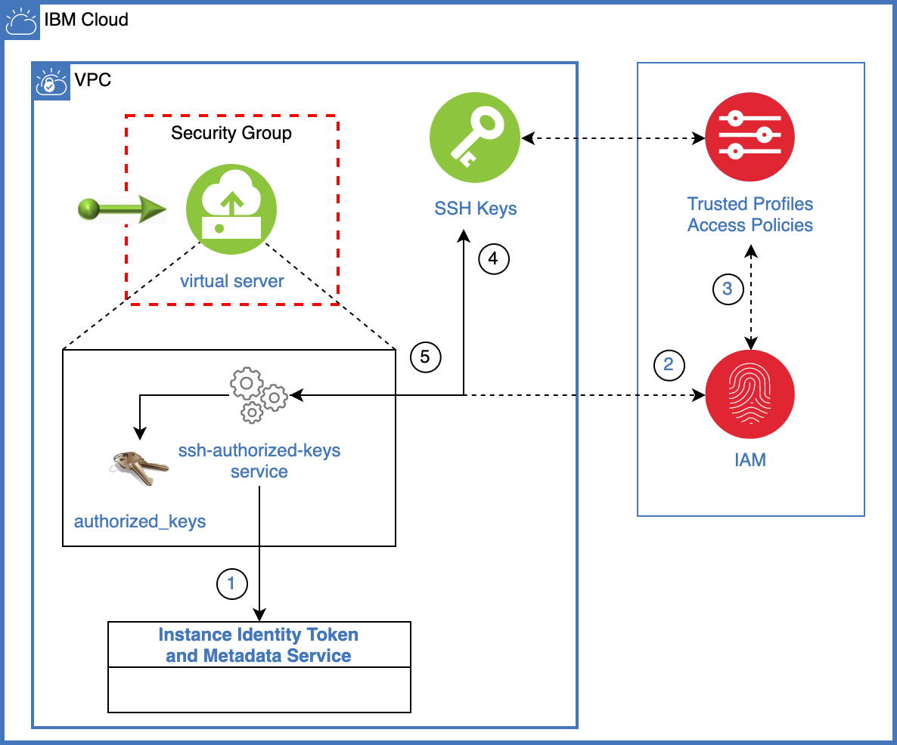

## Using Compute Identity / Instance Metadata / Trusted Profiles for SSH Keys

Use this Terraform template to provision a new Virtual Private Cloud (VPC) and Linux based Virtual Server Instance (VSI), configure IAM Trusted Profile for that instance and automate the update of SSH keys that are authorized to authenticate with the VSI.

As of this writing, the VPC Instance Metadata service and the IAM Trusted Profiles for VPC VSI are in Select Availability. Contact [IBM support](https://cloud.ibm.com/docs/vpc?topic=vpc-getting-help) or your IBM Sales representative if you're interested in getting early access.

# Architecture

A VSI is deployed inside of a VPC with appropriate security groups. A small application, in this case a bash script ssh-authorized-keys.sh, is added as a running service on the instance.



# Costs

When you apply this template, you are charged for the resources that you configure.

You can remove all resources created by running a terraform destroy command [described below](#delete-all-resources). Make sure that you back up any data that you wish to keep before you start the deletion process.

# Requirements

- [Install IBM Cloud CLI](https://cloud.ibm.com/docs/cli?topic=cloud-cli-install-ibmcloud-cli) and required plugins:

  - infrastructure-services

- [Install jq](https://stedolan.github.io/jq/).

- [Install Terraform](https://www.terraform.io/downloads.html)

- [Download the IBM Cloud provider plugin for Terraform](https://github.com/IBM-Cloud/terraform-provider-ibm#download-the-provider-from-the-terraform-registry-option-1)

## Getting started

- Clone this repository locally.

  ```sh
    git clone git@github.com:dprosper/instance-metadata-trusted-profiles.git
  ```

- From a bash terminal window change to the `instance-metadata-trusted-profiles` directory.

### Build the environment in the IBM Cloud using a prepared Terraform script

- Copy the `terraform.tfvars.template` to another file called `terraform.tfvars`.

  ```sh
    cp terraform.tfvars.template terraform.tfvars
  ```

- Modify terraform.tfvars file to match your desired settings, the following properties must be set:

| Name             | Description                                                                                                                                                                                                                                                                                                                             | Default Value |
| ---------------- | --------------------------------------------------------------------------------------------------------------------------------------------------------------------------------------------------------------------------------------------------------------------------------------------------------------------------------------- | ------------- |
| ibmcloud_api_key | An API key is a unique code that is passed to an API to identify the application or user that is calling it. To prevent malicious use of an API, you can use API keys to track and control how that API is used. For more information about API keys, see [Understanding API keys](https://cloud.ibm.com/docs/iam?topic=iam-manapikey). |
| basename         | a value that will be used when naming resources it is added to the value of the name properties with a `-`, i.e. ci-vsi-1                                                                                                                                                                                                               | ci            |
| region           | name of the region to create the resources. See [here](https://cloud.ibm.com/docs/vpc?topic=vpc-creating-a-vpc-in-a-different-region) for more information.                                                                                                                                                                             | us-east       |
| resource_group   | name of your resource group you will be creating the resources under (must exist prior to usage)                                                                                                                                                                                                                                        | default       |

- Initialize the Terraform providers and modules. Run:

  ```sh
    terraform init
  ```

- Execute terraform plan:

  ```sh
    terraform plan
  ```

- Apply terraform:

  ```sh
    terraform apply
  ```

- The scripts will run to completion. If the script were to get interrupted for any reason, you can address the error, run a plan and apply again.

- Connect to the instance from your terminal using the SSH key that was generated for you by the Terraform template
  ```sh
    ssh -i local/build_key_rsa root@<floating_ip>
  ```

### Testing the dynamic SSH keys configuration

From your web browser go to the [IAM Trusted Profiles management page](https://cloud.ibm.com/iam/trusted-profiles) and click on the newly created profile, i.e. `<basename>-trusted-profile`.

- Notice in the **Trust relationship** tab the **Compute resources** section includes the VSI that was created by the Terraform template.
- Switch to the **Access policies** tab and click on **Assign access** to add additional SSH keys to the VSI.
  - Click on **IAM services**
  - Select **VPC Infrastructure Services**
  - Click on **Resources based on selected attributes**
  - Select **Resource type** and then **SSH Key for VPC**
  - Select **Key ID** and then pick the SSH key that you want to add to the VSI
  - Select **Viewer** under Platform access.
  - Click on **Add** and then **Assign**.
    > Note: You can add additional SSH keys by following the steps above prior to clicking on Assign.
- Wait at least 35 minutes and then try to SSH into the VSI with the newly added SSH Key.

  > Note: The default polling interval in the application is 30 minutes, you can adjust it if needed by editing the ssh-authorized-keys.sh file.

- The service that updates the authorized SSH keys writes a log file to the `/var/log/ssh-authorized-keys.log` directory on the VSI. You can view these logs when you are logged into the VSI or enable IBM Cloud Logging to capture these logs in your region.

## Delete all resources

Running the following script will delete all resources created earlier during the apply/build process.

```sh
   terraform destroy
```
